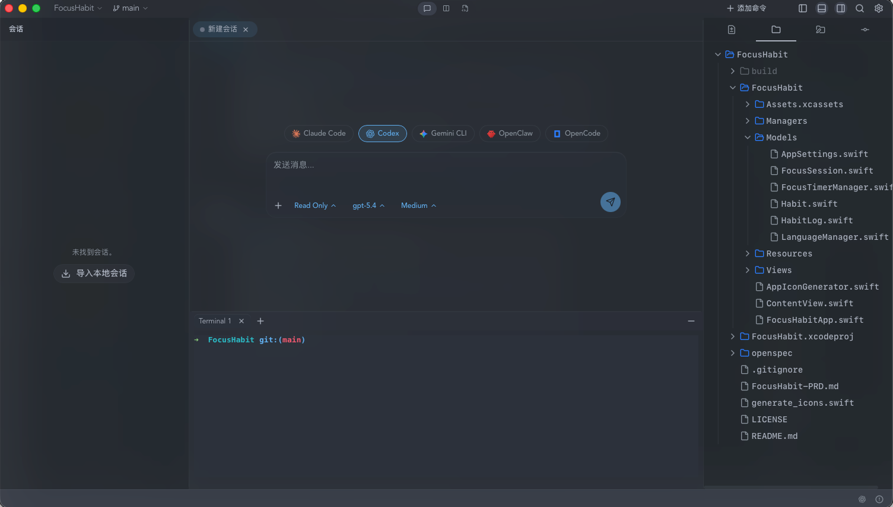

# NoIDEA

NoIDEA is a Tauri desktop app for aggregating, browsing, and continuing local AI coding agent sessions.

Repository: https://github.com/stickycandy/NoIDEA

It brings conversations from tools like Claude Code, Codex, and OpenCode into a single workspace, so you can inspect session history, review changed files, keep a terminal beside the conversation, and reopen projects without hopping across separate local clients.



## Overview

Modern coding agents leave useful context scattered across local folders, logs, and tool-specific session formats. NoIDEA turns those local artifacts into a unified desktop workspace.

Instead of treating each agent as an isolated app, NoIDEA gives you one place to:

- reopen working directories
- inspect conversation timelines
- review diffs and changed files
- use an integrated terminal
- keep auxiliary panels and session context visible while you work

The app is built around local-first workflows and a native desktop shell, with a Rust backend for filesystem access and a Next.js frontend for the UI.

## Features

- Multi-agent session aggregation for local coding tools
- Folder-based workspaces with dedicated desktop windows
- Conversation history and detail views
- Integrated terminal inside the same workspace
- Diff and changed-file inspection alongside the conversation
- Auxiliary panels for project navigation and related context
- macOS desktop packaging through Tauri

## Tech Stack

- Tauri 2
- Rust
- Next.js 16
- React 19
- TypeScript
- Tailwind CSS v4
- pnpm

## Getting Started

### Prerequisites

- Node.js
- pnpm
- Rust toolchain
- Tauri build requirements for your platform

### Install Dependencies

```bash
pnpm install
```

### Run in Development

Start the full desktop app:

```bash
pnpm tauri dev
```

Start only the frontend:

```bash
pnpm dev
```

## Build

Build the frontend:

```bash
pnpm build
```

Build the desktop app:

```bash
pnpm tauri build
```

## Project Structure

```text
src/                Next.js frontend
src-tauri/          Tauri + Rust backend
docs/images/        README screenshots and assets
```

## Architecture

- `src-tauri/` handles local filesystem access, session parsing, window management, and native desktop integration.
- `src/` contains the application UI, workspace layout, settings pages, terminal view, and conversation experience.
- Parsers normalize session data from different coding agents into shared models that the frontend can render consistently.

## Development Notes

- The app is designed around local filesystem session data.
- Current packaging and visual polish are primarily focused on macOS.
- Updater artifact signing requires `TAURI_SIGNING_PRIVATE_KEY`.
- Some existing updater/release configuration may still point to earlier project infrastructure.

## License

See [LICENSE](./LICENSE).
